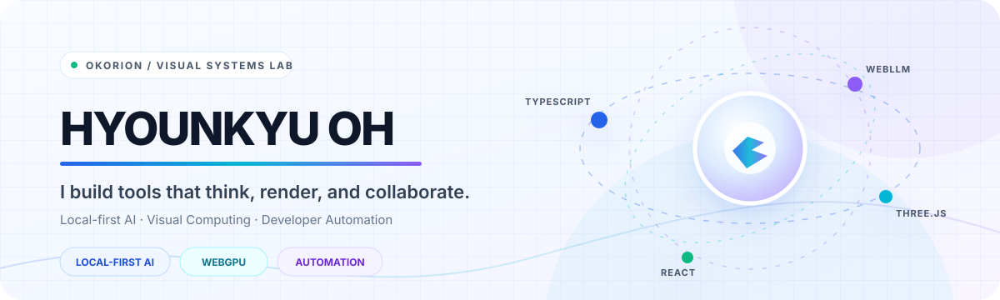
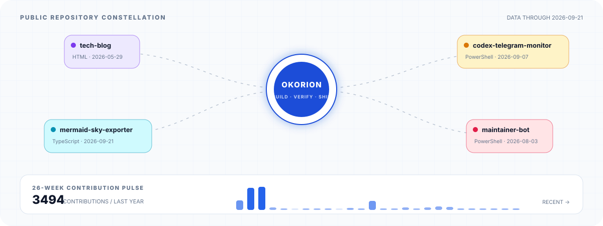

<picture>
  <source media="(prefers-color-scheme: dark) and (max-width: 600px)" srcset="./assets/hero-mobile-dark.svg" />
  <source media="(prefers-color-scheme: light) and (max-width: 600px)" srcset="./assets/hero-mobile-light.svg" />
  <source media="(prefers-color-scheme: dark)" srcset="./assets/hero-dark.svg" />
  <source media="(prefers-color-scheme: light)" srcset="./assets/hero-light.svg" />
  
</picture>

  <strong>Editor·Builder의 복잡한 상태를 저장·Runtime·서버까지 연결합니다.</strong> 
  Product / Application Engineer · React · TypeScript · Three.js

  <a href="https://okorion.github.io">Portfolio</a> ·
  <a href="#selected-work">Public Builds</a> ·
  <a href="https://okorion.github.io/?view=3d">3D Lab</a> ·
  <a href="https://okorion.github.io/tech-blog/">Tech Blog</a>

## About

React·TypeScript·Three.js 기반의 2D·3D Editor·Builder와 지도 제품을 개발해 왔습니다. 편집 상태와 command·event, 저장 모델, Runtime 실행의 의미를 맞추고 모바일·현장·운영 환경에서 실제 동작을 검증합니다.

공개 프로젝트에서는 local-first AI, 3D·데이터 시각화와 개발 자동화 도구를 실험합니다. 현업 제품과 개인 공개 프로젝트의 책임 범위는 구분해 기록합니다.

## Selected Work

### 01 — [LocalMesh Studio](https://github.com/okorion/localmesh-studio)

**Local AI meets collaborative 3D editing.** 브라우저의 3D 편집, 로컬 LLM 기반 오브젝트 생성, Yjs 기반 동기화 흐름을 한데 조합해 아이디어를 검증한 실험형 Studio 사이드 프로젝트입니다.

`TypeScript` · `React` · `Three.js` · `WebGPU` · `WebLLM` · `Yjs` · `Hocuspocus` · `IndexedDB`

[Live demo](https://localmesh-studio.okorion.chatgpt.site) · [Source](https://github.com/okorion/localmesh-studio)

### 02 — [VizPort Studio](https://github.com/okorion/vizport-studio)

**From raw data to explainable visualization and portable code.** CSV·JSON을 브라우저에서 분석하고 적합한 차트를 추천한 뒤 React 코드, LLM 프롬프트, VizSpec으로 가져갈 수 있는 시각화 스튜디오입니다.

`React` · `TypeScript` · `ECharts` · `Local-first` · `WebLLM`

[Live demo](https://vizport-studio.okorion.chatgpt.site) · [Source](https://github.com/okorion/vizport-studio) · [Architecture](https://github.com/okorion/vizport-studio/blob/main/ARCHITECTURE.md)

### More from the lab

- [**Mermaid Sky Exporter**](https://github.com/okorion/mermaid-sky-exporter) — Mermaid 작성, 공유, SVG·PNG·JPG 내보내기를 연결한 PWA 
  `Next.js` · `Mermaid` · `Monaco`
- [**Codex App Telegram Monitor**](https://github.com/okorion/codex-app-telegram-monitor) — Telegram을 통한 Windows Codex App 상태 점검과 원격 자동화 
  `PowerShell` · `Telegram API`
- [**Self-Improving Maintainer Bot**](https://github.com/okorion/self-improving-maintainer-bot) — 실패 사례를 eval로 축적하고 검증된 개선 PR을 제안하는 루프 
  `Python` · `GitHub Actions` · `Codex`

## Signals from the lab

<picture>
  <source media="(prefers-color-scheme: dark)" srcset="./assets/lab-signal-dark.svg" />
  <source media="(prefers-color-scheme: light)" srcset="./assets/lab-signal-light.svg" />
  
</picture>

주요 공개 저장소와 최근 기여 활동을 이 저장소의 GitHub Actions가 직접 SVG로 생성합니다. 외부 통계 카드 서비스에 의존하지 않습니다.

## Core & Experiments

**Core** — `TypeScript` · `React` · `MobX` · `Three.js` · `Web Editor / Builder` · `Runtime Integration`

**Exploring** — `Next.js` · `WebGPU` · `WebLLM` · `Local-first systems` · `Developer automation`

## Principles

- **Align state meaning first** — 화면, 저장 모델, Runtime과 서버가 같은 사용자 의도를 가리키게 합니다.
- **Verify in the real environment** — 저장·재진입·모바일·현장·운영 환경에서 실제 동작을 확인합니다.
- **Keep judgment visible** — 자동화와 AI에는 검증 가능한 경계와 사람의 승인 지점을 남깁니다.

---

  <a href="https://okorion.github.io">Portfolio</a> ·
  <a href="https://github.com/okorion?tab=repositories">Repositories</a> ·
  <a href="https://okorion.github.io/tech-blog/">Tech Blog</a>

